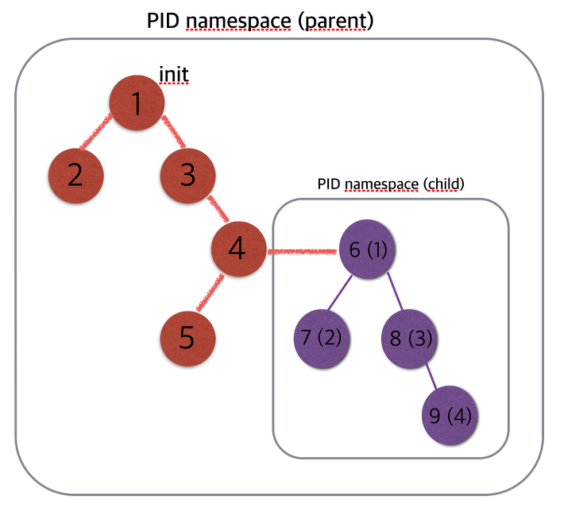

# namespace
namespace是linux kernel提供的一种为一系列进程提供隔离的资源(比如pid, hostname, user id, network, ipc和filesystem等)的特性。  

和某个namespace关联的进程只能看见和这个namespace关联的资源。

namespace一个常见的用途是实现容器化技术，比如Docker。  

## 查看是否支持namespace
查看kernel是否支持namespace

```
# cat /boot/config-$(uname -a | awk '{print $3}') | grep "CONFIG_USER_NS=y"
```

如果输出"CONFIG_USER_NS=y"就表示支持namespace。  


查看内核支持哪些namespace:   
找到clone 命令的online manual([http://man7.org/linux/man-pages/man2/clone.2.html](http://man7.org/linux/man-pages/man2/clone.2.html))，搜索CLONE_NEW字符，可以找到所有支持的namespace。如下:  

| namespace | clone_flag | 开始支持的kernel版本 | 隔离内容
| --------- | ---------- | ------------------ | -------
| Cgroup | CLONE_NEWCGROUP | 4.6 | Cgroup root directory
| IPC | CLONE_NEWIPC | 2.6.19 | System V IPC, POSIX message queues
| Network | CLONE_NEWNET | 2.6.24 | Network devices, stacks, ports, etc.
| Mount | CLONE_NEWNS | 2.4.19 | Mount points
| PID | CLONE_NEWPID | 2.6.24 | Process IDs  
| User | CLONE_NEWUSER | 2.6.23 |  User and group IDs
| UTS | CLONE_NEWUTS | 2.6.19 | Hostname and NIS domain name


# namespace API
namespace API包括[clone](http://man7.org/linux/man-pages/man2/clone.2.html), [setns](http://man7.org/linux/man-pages/man2/setns.2.html), [unshare](http://man7.org/linux/man-pages/man2/unshare.2.html)

## clone
clone()实际上是Linux系统调用fork()的一种更通用的实现方式，可以通过使用flags来控制使用多少功能。

**在Docker中就是使用的clone()系统调用来使用namespace的。**

### /proc/[pid]/ns目录
从3.8的kernel开始，用户就可以在/proc/[pid]/ns文件下看到指向不同namespace号的文件，如下查看telegraf进程的ns信息:  

```
# ps -ef | grep telegraf
root      1265  1115  0 18:45 pts/1    00:00:00 grep --color=auto telegraf
telegraf 19651     1  1 Mar21 ?        07:10:17 /usr/bin/telegraf -config /etc/telegraf/telegraf.conf -config-directory /etc/telegraf/telegraf.d
# ls -l /proc/19651/ns
total 0
lrwxrwxrwx 1 telegraf telegraf 0 Apr 16 18:45 cgroup -> cgroup:[4026531835]
lrwxrwxrwx 1 telegraf telegraf 0 Apr 16 18:45 ipc -> ipc:[4026531839]
lrwxrwxrwx 1 telegraf telegraf 0 Apr 16 18:45 mnt -> mnt:[4026531840]
lrwxrwxrwx 1 telegraf telegraf 0 Apr 16 18:45 net -> net:[4026531969]
lrwxrwxrwx 1 telegraf telegraf 0 Apr 16 18:45 pid -> pid:[4026531836]
lrwxrwxrwx 1 telegraf telegraf 0 Apr 16 18:45 user -> user:[4026531837]
lrwxrwxrwx 1 telegraf telegraf 0 Apr 16 18:45 uts -> uts:[4026531838]
```

比如net -> net:[4026531969]中4026531969就是namespace号。  

如果两个进程指向的namespace号相同，就说明它们在同一个namespace下面。  

在/proc/[pid]/ns文件里面设置link的作用是，如果该namespace下的进程结束了(进程结束了/proc/[pid]/目录就不存在了)，这个namespace还存在，后序的进程还可以加入进来。  

保留namespace的目的是为以后的进程加入做准备。  

也可以通过mount --bind的方式在进程结束的前提下，将namespace保留下来。

## setns
setns()系统调用的作用是将一个进程和一个namespace关联起来。  

在Docker中使用docker exec命令在已经运行的容器中执行一个新的命令，就需要用到该方法。

## unshare
unshare()系统调用使某进程脱离某个namespace。  


# 各种命名空间
不同类型的命名空间之间没有关系,我们分析问题的时候需要确定某类命名空间。

比如两个进程在同一个pid命名空间,那他们的pid命名空间的编号都是number1;在同一个mount命名空间,那他们的mount命名空间编号是number2.
number1和number2没有关系。


比如，查看pid为1和2的两个进程，他们对应的命名空间的编号是一样的，那他们就在一个命名空间里面。(注意ipc、mnt等的编号不是一样的，因为虽然都是命名空间，但是类型不一样)。

进程可以加入全部的命名空间，也可以不加入某个命名空间；但是对于某类型的命名空间，只能加入一个。  

```
# ls -l /proc/1/ns
total 0
lrwxrwxrwx 1 root root 0 Apr 17 18:14 ipc -> ipc:[4026531839]
lrwxrwxrwx 1 root root 0 Apr 17 18:14 mnt -> mnt:[4026531840]
lrwxrwxrwx 1 root root 0 Apr 17 18:14 net -> net:[4026531956]
lrwxrwxrwx 1 root root 0 Apr 17 18:14 pid -> pid:[4026531836]
lrwxrwxrwx 1 root root 0 Apr 17 18:14 uts -> uts:[4026531838]
# ls -l /proc/2/ns
total 0
lrwxrwxrwx 1 root root 0 Apr 17 18:14 ipc -> ipc:[4026531839]
lrwxrwxrwx 1 root root 0 Apr 17 18:14 mnt -> mnt:[4026531840]
lrwxrwxrwx 1 root root 0 Apr 17 18:14 net -> net:[4026531956]
lrwxrwxrwx 1 root root 0 Apr 17 18:14 pid -> pid:[4026531836]
lrwxrwxrwx 1 root root 0 Apr 17 18:14 uts -> uts:[4026531838]
```

找一个docker容器，查看容器中进程在root namespace中的pid

```
# docker ps
CONTAINER ID        IMAGE               COMMAND                  CREATED             STATUS              PORTS               NAMES
06e57d507c54        nginx               "nginx -g 'daemon off"   About an hour ago   Up About an hour    80/tcp, 443/tcp     elegant_ride

# docker top 06e57d507c54
UID                 PID                 PPID                C                   STIME               TTY                 TIME                CMD
root                3639                3623                0                   16:28               ?                   00:00:00            nginx: master process nginx -g daemon off;
104                 3663                3639                0                   16:28               ?                   00:00:00            nginx: worker process
root                6213                6198                0                   17:19               pts/1               00:00:00            /bin/bash
```

容器里面两个pid为3639和3663的进程，这两个进程在一个容器里面，所有他们的各个命名空间的编号是一样的；但是和root namespace的编号不一样。  

```
# ls -l /proc/3639/ns
total 0
lrwxrwxrwx 1 root root 0 Apr 17 17:19 ipc -> ipc:[4026532166]
lrwxrwxrwx 1 root root 0 Apr 17 17:19 mnt -> mnt:[4026532164]
lrwxrwxrwx 1 root root 0 Apr 17 16:28 net -> net:[4026532169]
lrwxrwxrwx 1 root root 0 Apr 17 17:19 pid -> pid:[4026532167]
lrwxrwxrwx 1 root root 0 Apr 17 17:19 uts -> uts:[4026532165]

# ls -l /proc/3663/ns
total 0
lrwxrwxrwx 1 104 107 0 Apr 17 18:15 ipc -> ipc:[4026532166]
lrwxrwxrwx 1 104 107 0 Apr 17 18:15 mnt -> mnt:[4026532164]
lrwxrwxrwx 1 104 107 0 Apr 17 18:15 net -> net:[4026532169]
lrwxrwxrwx 1 104 107 0 Apr 17 18:15 pid -> pid:[4026532167]
lrwxrwxrwx 1 104 107 0 Apr 17 18:15 uts -> uts:[4026532165]
```


## PID(CLONE_NEWPID)
PID namespace隔离非常使用，它对进程PID重新编号，即两个不同的namespace下的进程可以有相同的PID。 

查看进程的最大编号:  

```
# cat /proc/sys/kernel/pid_max
32768
``` 



每个PID namespace都有自己的计数程序。内核为所有的PID namespace维护了一个树状结构，最顶层的是系统初始化时创建的(比如图中的init进程所在的namespace)，被称为root namespace。之后创建的新PID namespace被称为child namespace(比如图中pid为4的进程创建的child namespace)。

child namespace中的进程有两个PID，一个是全局的，比如pid为6的进程，6就是全局的pid；1是pid为6的进程在child namespace中的pid。

parent namespace中的进程可以看到chilid namespace中的进程，并可以通过信号等方式对子节点中的进程产生影响；但是child namespace中的进程却不能看到parent namespace中的进程。  

有如下规律：  

* 每个PID namespace中的第一个进程的PID为1，像Linux中的init或systemd进程一样拥有特权
* child namespace中的进程，不能看到parent namespace中的进程；更不能使用kill影响parent namespace中这些进程了
* 如果在新的PID namespace中重新挂载了proc文件系统到/proc目录，会发现/proc目录下只显示同属于一个PID namespace中的其他进程
* 在root namespace中可以看到所有的进程(包括child namespace中的进程，因为child namespace中的进程也在root namespace中有一个全局的PID)

测试代码:  

vi newpid_tutorial.c

```
#define _GNU_SOURCE
#include <sys/types.h>
#include <sys/wait.h>
#include <stdio.h>
#include <sched.h>
#include <signal.h>
#include <unistd.h>
#define STACK_SIZE (1024 * 1024)

static char child_stack[STACK_SIZE];

int child_main(void* arg) {
    printf("The child process pid in child pid namespace is: %d\n", getpid());
    sleep(60);
}

int main() {
    printf("The parent process pid in root pid namespace is: %d\n", getpid());
    int child_pid = clone(child_main, child_stack+STACK_SIZE, CLONE_NEWPID | SIGCHLD, NULL);
    printf("The child process pid in root pid namespace is: %d\n", child_pid);
    waitpid(child_pid, NULL, 0);
    return 0;
}
```

编译运行:  

```
# gcc newpid_tutorial.c -o newpid_tutorial.bin
# ./newpid_tutorial.bin
The parent process pid in root pid namespace is: 7394
The child process pid in root pid namespace is: 7395
The child process pid in child pid namespace is: 1
```

上面代码运行时会sleep 60s，便于我们查看进程的namespace信息(进程结束后就看不到这个进程的namespace信息了):  

```
# ls -l /proc/1/ns
total 0
lrwxrwxrwx 1 root root 0 Apr 18 03:21 ipc -> ipc:[4026531839]
lrwxrwxrwx 1 root root 0 Apr 18 03:21 mnt -> mnt:[4026531840]
lrwxrwxrwx 1 root root 0 Apr 18 03:21 net -> net:[4026531956]
lrwxrwxrwx 1 root root 0 Apr 18 03:21 pid -> pid:[4026531836]
lrwxrwxrwx 1 root root 0 Apr 18 03:21 uts -> uts:[4026531838]
# ls -l /proc/7394/ns
total 0
lrwxrwxrwx 1 root root 0 Apr 18 04:49 ipc -> ipc:[4026531839]
lrwxrwxrwx 1 root root 0 Apr 18 04:49 mnt -> mnt:[4026531840]
lrwxrwxrwx 1 root root 0 Apr 18 04:49 net -> net:[4026531956]
lrwxrwxrwx 1 root root 0 Apr 18 04:49 pid -> pid:[4026531836]
lrwxrwxrwx 1 root root 0 Apr 18 04:49 uts -> uts:[4026531838]
# ls -l /proc/7395/ns
total 0
lrwxrwxrwx 1 root root 0 Apr 18 04:49 ipc -> ipc:[4026531839]
lrwxrwxrwx 1 root root 0 Apr 18 04:49 mnt -> mnt:[4026531840]
lrwxrwxrwx 1 root root 0 Apr 18 04:49 net -> net:[4026531956]
lrwxrwxrwx 1 root root 0 Apr 18 04:49 pid -> pid:[4026532157]
lrwxrwxrwx 1 root root 0 Apr 18 04:49 uts -> uts:[4026531838]
```

可以发现

* 父进程在root namespace中的pid为7394，7394号进程和root namespace中pid为1的进程，所有的namespace编号都是一样的。
* 子进程在root namespace中的pid位7395，7395号进程和它的父进程7394号进程，唯一不同的是pid namespace不一样，其他的namespace都是一样的；这是因为在上面的代码中只使用了CLONE_NEWPID，就只会隔离pid namespace


## Mount(CLONE_NEWNS)
由于这是Linux上第一个namespace，所以叫NS；用来隔离文件系统。  

比如在子进程中默认和root namespace共享/proc目录。使用CLONE_NEWNS，在子进程中的mount和umount都只会在子进程中有效。  

https://segmentfault.com/a/1190000006912742
http://hustcat.github.io/namespace-implement-1/


## UTS(CLONE_NEWUTS)
Unix Time-sharing System。


# demo
### 测试代码
引用于[http://dockone.io/article/81](http://dockone.io/article/81)

vi get_pid_namespace.c

```
#define _GNU_SOURCE
#include <sys/types.h>
#include <sys/wait.h>
#include <stdio.h>
#include <sched.h>
#include <signal.h>
#include <unistd.h>
#define STACK_SIZE (1024 * 1024)
// sync primitive
int checkpoint[2];
static char child_stack[STACK_SIZE];
char* const child_args[] = {
"/bin/bash",
NULL
};


int child_main(void* arg) {
char c;
// init sync primitive
close(checkpoint[1]);
// wait...
read(checkpoint[0], &c, 1);
printf(" - [%5d] World !\n", getpid());
sethostname("In Namespace", 12);
execv(child_args[0], child_args);
printf("Ooops\n");
return 1;
}


int main() {
    // init sync primitive
    pipe(checkpoint);
    printf(" - [%5d] Hello ?\n", getpid());
    int child_pid = clone(child_main, child_stack+STACK_SIZE, CLONE_NEWUTS | CLONE_NEWIPC | CLONE_NEWPID | SIGCHLD, NULL);
    close(checkpoint[1]);
    waitpid(child_pid, NULL, 0);
    return 0;
}

```

### 运行代码

编译链接

```
# gcc get_pid_namespace.c -o get_pid_namespace.bin
```


运行

```
# ./get_pid_namespace.bin
 - [24608] Hello ?
 - [    1] World !
[root@In Namespace tutorial]# echo $$
1
[root@In Namespace tutorial]# kill -9 24608
bash: kill: (24608) - No such process
```

可以看出打印当前进程编号返回的是1，并且在子进程中看不到父进程了。  


但是在子进程中执行ps命令时，看到的还是全局的进程号，如下:  

```
[root@In Namespace tutorial]# ps
  PID TTY          TIME CMD
24419 pts/0    00:00:00 sudo
24420 pts/0    00:00:00 su
24421 pts/0    00:00:00 bash
24608 pts/0    00:00:00 get_pid_namespa
24609 pts/0    00:00:00 bash
24622 pts/0    00:00:00 ps
```

因为ps工具是从/proc目录获取的信息，而/proc还没有被隔离


### 隔离fs
将上面的代码的clone函数中加上CLONE_NEWNS，如下:  

```
    int child_pid = clone(child_main, child_stack+STACK_SIZE, CLONE_NEWUTS | CLONE_NEWIPC | CLONE_NEWPID | CLONE_NEWNS  | SIGCHLD, NULL);
```    

重新编译和链接。  

```
# ./get_pid_namespace.bin
[root@In Namespace tutorial]# mount -t proc proc /proc
[root@In Namespace tutorial]# ps -ef
UID        PID  PPID  C STIME TTY          TIME CMD
root         1     0  0 16:06 pts/0    00:00:00 /bin/bash
root        19     1  0 16:08 pts/0    00:00:00 ps -ef
```   

可以看到ps命令显示的是这个namespace下面的PID了，而不是全局的PID。


？？？为什么要mount到/proc，这个root namespace的目录。


# 网络命名空间


# TODO
一个进程可以在多个namespace中吗？可以有两个以上pid吗？
可以有多个层级的namespace吗？比如孙子


# 参考
* http://man7.org/linux/man-pages/man2/clone.2.html
* http://man7.org/linux/man-pages/man7/namespaces.7.html
* man setns


