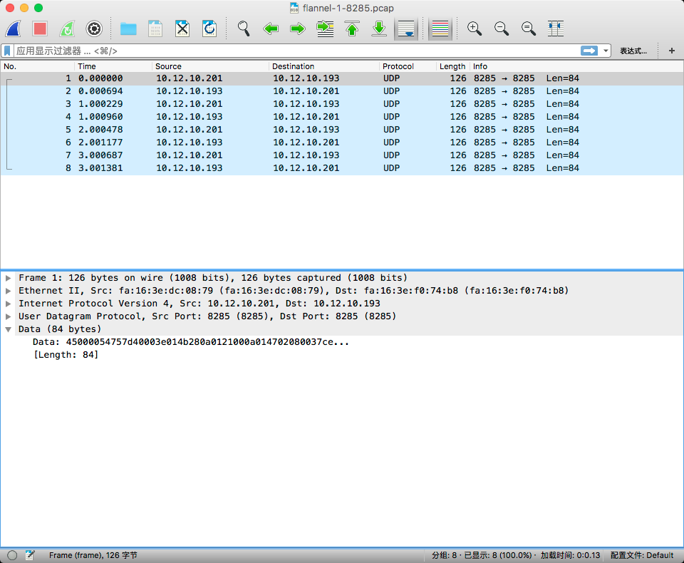
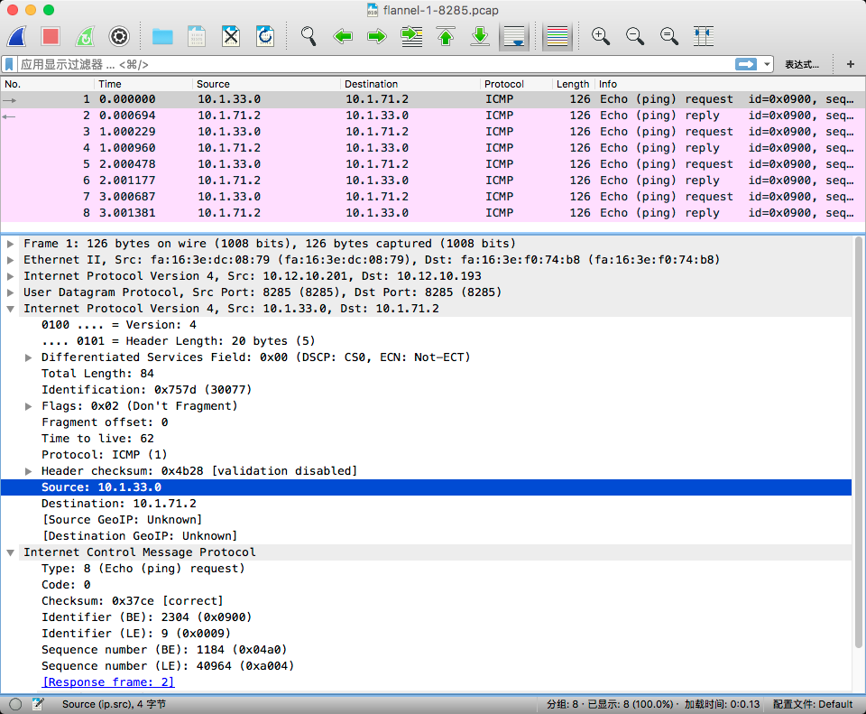

# Flannel

flannel是一个虚拟网络，通过flannel我们可以给每个运行docker的宿主机一个子网。


# 安装与配置
flannel的所有配置信息都存放在etcd里面，如果没有可以使用我写的一个ansible role安装(支持etcd TLS配置)，地址是:  [https://galaxy.ansible.com/frank6866/etcd/](https://galaxy.ansible.com/frank6866/etcd/)

假设已经有了一套etcd集群了，信息如下:  

```
https://10.12.10.209:2379,https://10.12.10.200:2379,https://10.12.10.210:2379
```

## CentOS7
### 安装
CentOS7中的extras仓库包含了flannel的rpm包，不需要额外添加仓库，直接安装即可，如下:  

```
# yum list | grep flannel
flannel.x86_64                          0.7.0-1.el7                    @extras

# yum install flannel
```


### etcd用户及权限设置
在etcd中某个目录下(比如/flannel-test/network/，这个目录作为/etc/sysconfig/flanneld中的FLANNEL_ETCD_PREFIX)创建一个名为config的key，用来存放flannel的网络信息，如下:  

```
# etcdctl set /flannel-test/network/config '{ "Network": "10.1.0.0/16" }'
```

创建一个名为flannel-test的用户: 

```
# etcdctl user add flannel-test
```  

创建一个名为role-flannel的role:  

```
# etcdctl role add role-flannel
Role role-flannel created
```

给role-flannel赋予FLANNEL_ETCD_PREFIX下的权限:  

```
# etcdctl role grant role-flannel -path '/flannel-test/*' -readwrite
```

将用户flannel-test添加到role-flannel中:  

```
# etcdctl user grant flannel-test -roles role-flannel
```


### flannel配置
flannel配置文件的路径是**/etc/sysconfig/flanneld**，配置项说明如下(可以使用flannel -h命令查看所有的配置项):  

* FLANNEL_ETCD_ENDPOINTS: etcd的endpoints，比如"https://10.12.10.209:2379,https://10.12.10.200:2379,https://10.12.10.210:2379"
* FLANNEL_ETCD_PREFIX: flannel在etcd中存储的配置的文件夹，flannel会读取etcd中FLANNEL_ETCD_PREFIX所配置的路径下名为**config**的键。比如/flannel-test/network

> 注意: 在CentOS7上flannel0.7.0版本的配置文件中，etcd的配置中，除了endpoints和prefix外，其他的配置(比如ca)需要放在FLANNEL_OPTIONS中，如果使用FLANNEL_ETCD_CAFILE环境变量不能被识别。

**可以通过ps -ef | grep flanneld命令查看flannd启动时是否加载了所有的相关配置**

如果etcd配置了TLS及authentication，需要配置如下配置项:  

```
FLANNEL_OPTIONS="-etcd-cafile=/etc/pki/etcd/cacert.pem -etcd-certfile=/etc/pki/etcd/etcd.crt -etcd-keyfile=/etc/pki/etcd/private/etcd.key -etcd-username=flannel-test -etcd-password=mypassword"
```


示例配置文件如下:  

```
# grep -v '^#\|^$' /etc/sysconfig/flanneld
FLANNEL_ETCD_ENDPOINTS="https://10.12.10.209:2379,https://10.12.10.200:2379,https://10.12.10.210:2379"
FLANNEL_ETCD_PREFIX="/flannel-test/network"
FLANNEL_OPTIONS="-etcd-cafile=/etc/pki/etcd/cacert.pem -etcd-certfile=/etc/pki/etcd/etcd.crt -etcd-keyfile=/etc/pki/etcd/private/etcd.key -etcd-username=flannel-test -etcd-password=mypassword"
```

### 启动flannel
```
# systemctl enable flanneld
# systemctl start flanneld
```

> 如果启动失败，使用journalctl -lf -u flanneld命令查看日志


# 原理分析
假设宿主机vm-docker-1上只有一块网卡，其IP地址是10.12.10.200，flannel配置的全局网络是10.1.0.0/16。

当在vm-docker-1上启动flannel时，会在vm-docker-1上创建一个名为flannel0的tun类型的设备:  

```
# ip address show flannel0
30: flannel0: <POINTOPOINT,MULTICAST,NOARP,UP,LOWER_UP> mtu 1472 qdisc pfifo_fast state UNKNOWN qlen 500
    link/none
    inet 10.1.82.0/16 scope global flannel0
       valid_lft forever preferred_lft forever

# ip address show docker0
4: docker0: <NO-CARRIER,BROADCAST,MULTICAST,UP> mtu 1472 qdisc noqueue state DOWN
    link/ether 02:42:08:dc:c2:66 brd ff:ff:ff:ff:ff:ff
    inet 10.1.82.1/24 scope global docker0
       valid_lft forever preferred_lft forever
    inet6 fe80::42:8ff:fedc:c266/64 scope link
       valid_lft forever preferred_lft forever

# ethtool -i flannel0
driver: tun
version: 1.6
firmware-version:
bus-info: tun
supports-statistics: no
supports-test: no
supports-eeprom-access: no
supports-register-dump: no
supports-priv-flags: no
```

flannel0的ip地址为10.1.82.0/16，并给docker0网桥设置了一个IP地址10.1.82.1/24。

查看etcd可以发现，在FLANNEL_ETCD_PREFIX目录下的subnets目录下，多了一个名为10.1.82.0-24的key，刚好是vm-docker-1宿主机上docker0网桥的网络地址，并且/flannel-test/network/subnets/10.1.82.0-24这个key的值是vm-docker-1宿主机的物理网卡的IP地址。  

```
# etcdctl ls /flannel-test/network/subnets
/flannel-test/network/subnets/10.1.82.0-24
# etcdctl get /flannel-test/network/subnets/10.1.82.0-24
{"PublicIP":"10.12.10.200"}
```


# 网络流向
## 网络流向测试
在两台宿主机flannel-1和flannel-2上配置好flannel，在两台宿主机上分别启动一个容器(**docker run -it busybox /bin/sh**)进行网络测试，观察两个宿主机上的容器是如何相互访问的。

| 宿主机 | public interface | flannel0 | docker0 | container
|-------|-----------|-------------|------------|-------------
| flannel-1 | eth0:10.12.10.201 | 10.1.33.0/16 | 10.1.33.1/24 | veth5858817:10.1.33.2/24
| flannel-2 | eth0:10.12.10.193 | 10.1.71.0/16 | 10.1.71.1/24 | veth15584af:10.1.71.2/24


在宿主机flannel-1的容器内ping宿主机flannel-2上的容器，在宿主机flannel-1上依次对veth***、docker0、flannel0、eth0进行抓包，观察数据流动:  

```
/ # ping -I 10.1.33.2 10.1.71.2
PING 10.1.71.2 (10.1.71.2) from 10.1.33.2: 56 data bytes
64 bytes from 10.1.71.2: seq=0 ttl=60 time=0.942 ms
64 bytes from 10.1.71.2: seq=1 ttl=60 time=0.990 ms
64 bytes from 10.1.71.2: seq=2 ttl=60 time=0.952 ms
......
```

### veth抓包
```
# tcpdump -i veth61e125c
tcpdump: WARNING: veth61e125c: no IPv4 address assigned
tcpdump: verbose output suppressed, use -v or -vv for full protocol decode
listening on veth61e125c, link-type EN10MB (Ethernet), capture size 65535 bytes
09:16:20.434174 IP 10.1.33.2 > 10.1.71.2: ICMP echo request, id 1536, seq 63, length 64
09:16:20.435138 IP 10.1.71.2 > 10.1.33.2: ICMP echo reply, id 1536, seq 63, length 64
09:16:21.434444 IP 10.1.33.2 > 10.1.71.2: ICMP echo request, id 1536, seq 64, length 64
09:16:21.435427 IP 10.1.71.2 > 10.1.33.2: ICMP echo reply, id 1536, seq 64, length 64
......
```

在veth上收到的响应的IP是flannel-2宿主机的容器的IP


### docker0抓包
```
# tcpdump -i docker0
tcpdump: verbose output suppressed, use -v or -vv for full protocol decode
listening on docker0, link-type EN10MB (Ethernet), capture size 65535 bytes
09:21:57.614569 IP 10.1.33.2 > 10.1.71.2: ICMP echo request, id 2304, seq 22, length 64
09:21:57.615857 IP 10.1.71.2 > 10.1.33.2: ICMP echo reply, id 2304, seq 22, length 64
09:21:58.614796 IP 10.1.33.2 > 10.1.71.2: ICMP echo request, id 2304, seq 23, length 64
09:21:58.615636 IP 10.1.71.2 > 10.1.33.2: ICMP echo reply, id 2304, seq 23, length 64
......
```

和veth一样，收到的响应的IP是flannel-2宿主机的容器的IP


### flannel0抓包
```
# tcpdump -n -i flannel0
tcpdump: verbose output suppressed, use -v or -vv for full protocol decode
listening on flannel0, link-type RAW (Raw IP), capture size 65535 bytes
09:26:02.669522 IP 10.1.33.0 > 10.1.71.2: ICMP echo request, id 2304, seq 267, length 64
09:26:02.670360 IP 10.1.71.2 > 10.1.33.0: ICMP echo reply, id 2304, seq 267, length 64
09:26:03.669794 IP 10.1.33.0 > 10.1.71.2: ICMP echo request, id 2304, seq 268, length 64
09:26:03.670639 IP 10.1.71.2 > 10.1.33.0: ICMP echo reply, id 2304, seq 268, length 64
......
```

数据包经过flannel-1上flannel0网卡后，其源IP地址变为flannel-1上flannel0的IP地址了


### eth0抓包
默认情况下，flannel使用UPD封装数据包，默认端口为8285，查看eth0上经过8285端口的数据包

```
# tcpdump -n -i eth0 port 8285
tcpdump: verbose output suppressed, use -v or -vv for full protocol decode
listening on eth0, link-type EN10MB (Ethernet), capture size 65535 bytes
09:39:02.846844 IP 10.12.10.201.8285 > 10.12.10.193.8285: UDP, length 84
09:39:02.847564 IP 10.12.10.193.8285 > 10.12.10.201.8285: UDP, length 84
......
```

可以看到宿主机flannel-1和flannel-2之间使用UDP通信，我们将数据包保存下来，使用wireshark看看UDP数据包里面的详细信息:  

```
# tcpdump -n -i eth0 port 8285 -w flannel-1-8285.pcap
```

使用wireshark打开上面保存的文件后，可以看到是UDP协议的数据包；数据包的Data部分包含了被分装的数据包，如下图:  



为了将Data部分显示为具体的协议(flannel中UDP封装的是IP协议)，我们右击wireshark，选择"解码为"，并将"当前"一列的值修改为IPv4，点击"OK"就可以看到Data部分被解码为IP和ICMP协议，如下图:  




可以发现，封装的ICMP数据包刚好就是flannel0中的数据包(源IP为10.1.33.0，目的IP为10.1.71.2)


## 网络流向分析
根据上面的抓包结果，大致的网络流向如下:  

| 设备 | source IP -> dest IP 
|-----|------
| veth | 10.1.33.2 > 10.1.71.2
| docker0 | 10.1.33.2 > 10.1.71.2
| flannel0 | 10.1.33.0 > 10.1.71.2
| eth0 | 10.12.10.201.8285 > 10.12.10.193.8285


查看容器的路由表:  

```
/ # ip r
default via 10.1.33.1 dev eth0
10.1.33.0/24 dev eth0  src 10.1.33.2
```

在宿主机flannel-1的容器(IP为10.1.33.2/24)中ping宿主机flannel-2的容器(10.1.71.2/24)，由于目的IP地址在flannel-1的容器中没有匹配的路由规则，就会使用默认的路由规则，将数据包交个网关10.1.33.1(网关是一个设备，在这里体现为docker0)。


网关设备docker0收到数据包后，查看数据包的目的IP地址(10.1.71.2/24)，根据宿主机flannel-1的路由表:   

```
# ip r
default via 10.12.10.254 dev eth0  proto static
10.1.0.0/16 dev flannel0  proto kernel  scope link  src 10.1.33.0
10.1.33.0/24 dev docker0  proto kernel  scope link  src 10.1.33.1
10.12.10.0/24 dev eth0  proto kernel  scope link  src 10.12.10.201
169.254.169.254 via 10.12.10.208 dev eth0  proto static
```

发现匹配第二条规则(10.1.0.0/16 dev flannel0  proto kernel  scope link  src 10.1.33.0)，那么这个数据包就被发送到flannel0设备了。由于flannel0的路由规则中src为10.1.33.0，**所以经过flannel0后，源IP地址变为src指定的IP地址(即10.1.33.0)**。

当数据包从flannel0发出去的时候，flanneld进程会将数据包封装成UDP包(默认是UDP，也可以配置为vxlan)，源IP地址设置为eth0的IP地址(也就是flannel中--public-ip配置的IP地址)。

那么UDP包中的目的IP地址是怎么来的呢？  
在封UDP包前，目的IP地址是宿主机flannel-2上容器的IP地址(10.1.71.2)，根据这个IP我们可以在etcd找到对应的网络:  

```
# etcdctl ls /flannel-test/network/subnets
/flannel-test/network/subnets/10.1.72.0-24
/flannel-test/network/subnets/10.1.13.0-24
/flannel-test/network/subnets/10.1.22.0-24
/flannel-test/network/subnets/10.1.40.0-24
/flannel-test/network/subnets/10.1.71.0-24
/flannel-test/network/subnets/10.1.82.0-24
/flannel-test/network/subnets/10.1.65.0-24
/flannel-test/network/subnets/10.1.53.0-24
/flannel-test/network/subnets/10.1.63.0-24
/flannel-test/network/subnets/10.1.33.0-24
/flannel-test/network/subnets/10.1.106.0-24
```

可以知道对应的key是/flannel-test/network/subnets/10.1.71.0-24，查看这个key的内容:  

```
# etcdctl get /flannel-test/network/subnets/10.1.71.0-24
{"PublicIP":"10.12.10.193"}
```

UDP封包会将目的地址设置为PublicIP，即10.12.10.193。(和抓包结果一致)


### 官网给的包流向图
现在就很好理解官网的图了:  


flannel的性能测试请参考

测试环境: 三台宿主机，由于使用的是OpenStack创建的虚拟机，其中两台在一台物理机上，另一台在另一个物理机上。所以用。。。两个压。

先搞明白包量是个什么意思，就是iperf中-M表示什么意思？(测试的使用使用tcpdump抓包分析)

1. 物理机网络测试
2. 物理机上的虚拟机网络测试(使用bridge模式)
3. 虚拟机中的flannel容器网络测试，UDP封包
4. 虚拟机中的flannel容器网络测试，vxlan封包


# TODO
flannel 默认使用 8285 端口作为 UDP 封装报文的端口，VxLan 的话使用 8472 端口。

不同backend的实现及网络流量分析


需要注意的事项

flannel 默认采用 UDP 封装报文，在高并发情况下会有丢包问题
因为封装报文是在用户区进行的，会有一定的性能损失
要求所有主机在同一个网络，可以直接路由
会导致 ip 漂移：删除一台容器重新部署，容器的 ip 很可能会发生变化（新部署的容器落在另外一台主机上一定会导致 ip 不同）


# 参考
* http://www.fangyunlin.com/?p=54
* http://cizixs.com/2016/06/15/flannel-overlay-network